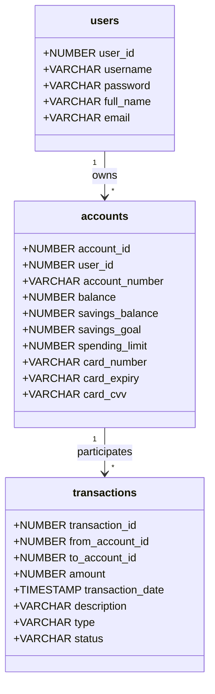
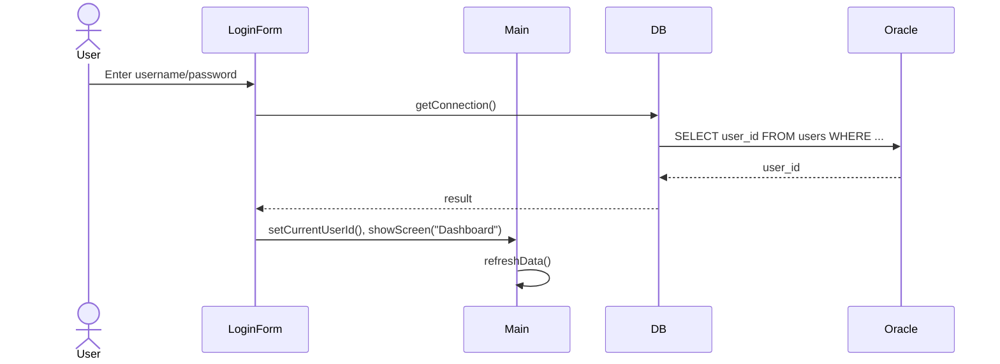
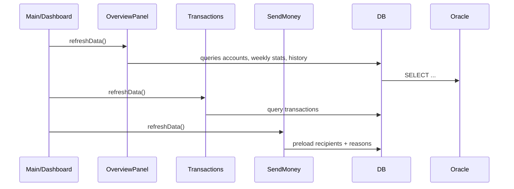
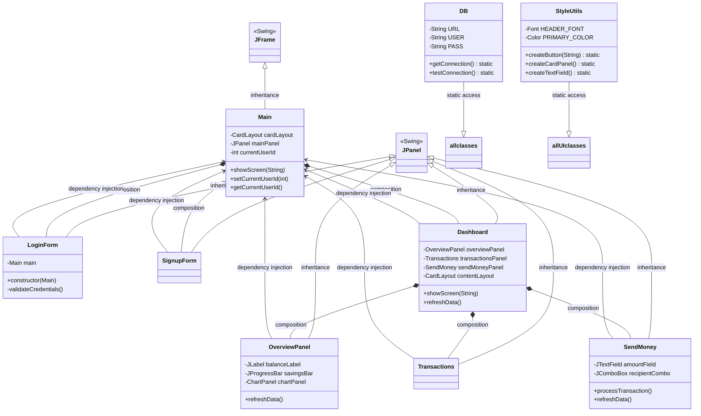

# Repository: https://github.com/Vorxiu/Vorsa

<style>
body {
  font-family: "JetBrainsMono Nerd Font", "JetBrains Mono", monospace;
}
code, pre {
  font-family: "JetBrainsMono Nerd Font", "JetBrains Mono", monospace;
}
</style>

## Real-Time System Design — Vorsa Banking App (OOP)

- Course: OOP
- System Type: Desktop banking client (Java Swing) with Oracle DB backend


 TABLE OF CONTENT
- [Repository: https://github.com/Vorxiu/Vorsa](#repository-httpsgithubcomvorxiuvorsa)
  - [Real-Time System Design — Vorsa Banking App (OOP)](#real-time-system-design--vorsa-banking-app-oop)
  - [1) System Overview](#1-system-overview)
  - [2) Architecture at a Glance](#2-architecture-at-a-glance)
  - [3) Module Breakdown and Responsibilities](#3-module-breakdown-and-responsibilities)
  - [4) Data Model (Oracle)](#4-data-model-oracle)
  - [5) Interaction Scenarios (Real-Time User Flows)](#5-interaction-scenarios-real-time-user-flows)
    - [5.1 Login Flow](#51-login-flow)
    - [5.2 Money Transfer (Atomic)](#52-money-transfer-atomic)
    - [5.3 Dashboard Refresh](#53-dashboard-refresh)
  - [6) OOP Concepts Applied](#6-oop-concepts-applied)
    - [6.1 Encapsulation](#61-encapsulation)
    - [6.2 Abstraction](#62-abstraction)
    - [6.3 Inheritance](#63-inheritance)
    - [6.4 Polymorphism](#64-polymorphism)
    - [6.5 Composition](#65-composition)
    - [6.6 Dependency Injection](#66-dependency-injection)
    - [6.7 Single Responsibility Principle (SRP)](#67-single-responsibility-principle-srp)
    - [6.8 Class Diagram: OOP Structure](#68-class-diagram-oop-structure)
  - [Summary: OOP in Vorsa](#summary-oop-in-vorsa)
  - [7) Non‑Functional Concerns](#7-nonfunctional-concerns)
  - [8) Deployment \& Dependencies](#8-deployment--dependencies)
  - [9) Limitations \& Future Enhancements](#9-limitations--future-enhancements)

## 1) System Overview
Vorsa is a desktop banking application that lets a user sign up, log in, view balances and recent activity, and transfer money to other users. It is implemented with:
- Presentation: Java Swing UI panels
- Application controller: Screen navigation via `CardLayout`
- Data access/persistence: Oracle Database (JDBC)

Near real-time feel is achieved by immediately committing financial operations and re-querying fresh state whenever users navigate between screens or complete actions (e.g., money transfer). This event-driven refresh keeps the UI state consistent with the database without requiring a separate background service.

Key entry points:
- Launcher and screen router: [src/main/java/org/vorxiu/Main.java](src/main/java/org/vorxiu/Main.java)
- Database connector: [src/main/java/org/vorxiu/DB.java](src/main/java/org/vorxiu/DB.java)
- Feature modules (UI panels): [src/main/java/org/vorxiu](src/main/java/org/vorxiu)


## 2) Architecture at a Glance
```mermaid
flowchart LR
  subgraph UI [Presentation Layer]
    A[LoginForm] -->|auth success| C[Dashboard]
    B[SignupForm] -->|create user+account| A
    C --> C1[OverviewPanel]
    C --> C2[Transactions]
    C --> C3[SendMoney]
  end

  subgraph APP [Application Controller]
    M[Main (JFrame + CardLayout)]
  end

  subgraph DAL [Data Access]
    D[DB.getConnection()]
  end

  subgraph DB[(Oracle Database)]
    U[(users)]
    Ac[(accounts)]
    T[(transactions)]
  end

  A  M
  B  M
  C  M
  C1 -. JDBC .-> D --> DB
  C2 -. JDBC .-> D --> DB
  C3 -. JDBC .-> D --> DB
```

Roles by layer:
- Presentation: Renders UI, captures events, formats data for users.
- Application controller: Tracks `currentUserId`, routes between screens, triggers `refreshData()`.
- Data access: Centralized JDBC connection acquisition via `DB` class.
- Database: Stores normalized domain state and enforces integrity.


## 3) Module Breakdown and Responsibilities

- Main (App Shell) — [Main.java](src/main/java/org/vorxiu/Main.java)
  - Manages window lifecycle and `CardLayout` screens: Login, Signup, Dashboard.
  - Holds `currentUserId` and exposes `showScreen()` that also refreshes data on entry.
  - Initializes FlatLaf light theme for consistent UI.

- DB (Data Access) — [DB.java](src/main/java/org/vorxiu/DB.java)
  - Provides `getConnection()` and `testConnection()` using Oracle JDBC.
  - Centralizes connection details; other modules depend on it for persistence.

- LoginForm (Authentication) — [LoginForm.java](src/main/java/org/vorxiu/LoginForm.java)
  - Validates credentials against `users` and sets `currentUserId` on success.
  - Navigates to Dashboard; shows errors for invalid login.

- SignupForm (Registration) — [SignupForm.java](src/main/java/org/vorxiu/SignupForm.java)
  - Inserts into `users`, then creates a default `accounts` row in a single DB transaction.
  - Randomizes initial card/account details; navigates user back to Login on success.

- Dashboard (Controller + Sidebar) — [Dashboard.java](src/main/java/org/vorxiu/Dashboard.java)
  - Hosts feature panels via an internal `CardLayout`: Overview, Transactions, Send Money.
  - Displays profile info pulled from `users`; handles Logout and tab switching.
  - Calls `refreshData()` on sub-panels to keep the UI synchronized with DB state.

- OverviewPanel (Balances, Card, Stats) — [OverviewPanel.java](src/main/java/org/vorxiu/OverviewPanel.java)
  - Queries account balances, savings progress, spending limit, and card details from `accounts`.
  - Calculates weekly transaction counts and draws a mini bar chart.
  - Shows a concise transaction history (latest 5) combining incoming/outgoing.

- Transactions (Ledger View) — [Transactions.java](src/main/java/org/vorxiu/Transactions.java)
  - Loads the full transaction list for the current user into a table.
  - Formats entries as Incoming/Outgoing with amounts and timestamps.

- SendMoney (Transfers) — [SendMoney.java](src/main/java/org/vorxiu/SendMoney.java)
  - Populates recipient list (other users) and standard reasons.
  - Executes a transfer in a single DB transaction: debit sender, credit recipient, insert `transactions` row, commit.
  - Validates amount, self-transfer, sufficient balance, and recipient existence; rolls back on failure.

- StyleUtils (UI Toolkit) — [StyleUtils.java](src/main/java/org/vorxiu/StyleUtils.java)
  - Centralizes look-and-feel primitives (fonts, colors, spacing, shared components), ensuring consistency and reuse.


## 4) Data Model (Oracle)
Tables defined in [database/schema.sql](database/schema.sql):
- `users(user_id, username, password, full_name, email)`
- `accounts(account_id, user_id, account_number, balance, savings_balance, savings_goal, spending_limit, card_number, card_expiry, card_cvv)`
- `transactions(transaction_id, from_account_id, to_account_id, amount, transaction_date, description, type, status)`




## 5) Interaction Scenarios (Real-Time User Flows)

### 5.1 Login Flow


### 5.2 Money Transfer (Atomic)
```mermaid
sequenceDiagram
  actor User
  participant SM as SendMoney
  participant DAL as DB
  participant SQL as Oracle
  User->>SM: Enter amount, recipient, reason
  SM->>DAL: getConnection(); setAutoCommit(false)
  DAL->>SQL: SELECT sender account/balance
  SQL-->>DAL: senderAccId, balance
  DAL->>SQL: SELECT recipient account by username
  SQL-->>DAL: recipientAccId
  DAL->>SQL: UPDATE accounts SET balance = balance - amount
  DAL->>SQL: UPDATE accounts SET balance = balance + amount
  DAL->>SQL: INSERT INTO transactions (..., 'TRANSFER')
  DAL->>SQL: COMMIT
  SM-->>User: "Transfer Successful" (UI clears form)
```

### 5.3 Dashboard Refresh


Real-time aspect: after any data-changing action (e.g., transfer), the next screen visit triggers `refreshData()` to fetch fresh state. This gives immediate feedback consistent with the committed DB state.


## 6) OOP Concepts Applied

### 6.1 Encapsulation
**Definition:** Bundle data (state) and behavior (methods) within a class, exposing only necessary interfaces.

**Example:**
```java
// LoginForm.java — Encapsulates login UI state and validation logic
public class LoginForm extends JPanel {
    private Main main;  // Private reference to parent
    
    // Constructor + initialization (private UI setup)
    public LoginForm(Main main) {
        this.main = main;
        // UI components created and configured privately
        JTextField accountField = StyleUtils.createTextField();
        // ...
        loginButton.addActionListener(e -> {
            // Action encapsulated: only entry point is the button
            // DB query, error handling all hidden inside
        });
    }
}
```
Each panel hides:
- UI component construction details
- JDBC query/update logic
- Validation rules
- Event handling

Public interface: `refreshData()` to fetch fresh state; constructor and action listeners are the only entry points.

### 6.2 Abstraction
**Definition:** Hide complex implementation; expose simple, meaningful interfaces.

**Example:**
```java
// DB.java — Abstracts JDBC connection complexity
public class DB {
    private static final String URL = "jdbc:oracle:thin:@localhost:1521/FREEPDB1";
    // ... other constants hidden
    
    public static Connection getConnection() throws SQLException {
        // Caller doesn't care about URL parsing, driver loading, credentials
        return DriverManager.getConnection(URL, USER, PASS);
    }
}

// Usage in SendMoney.java
try (Connection conn = DB.getConnection()) {
    // Simple, abstracted API — just get a connection; all details hidden
}
```

`StyleUtils` abstracts component creation:
```java
public static JButton createButton(String text) {
    JButton button = new JButton(text);
    button.setBackground(BUTTON_COLOR);
    button.setForeground(Color.WHITE);
    // ... boilerplate styling
    return button;
}

// Caller: just calls createButton("Login") — styling details hidden
```

### 6.3 Inheritance
**Definition:** Parent class defines shared behavior; child classes specialize or override.

**Example:**
- `LoginForm`, `SignupForm`, `OverviewPanel`, `Transactions`, `SendMoney` all extend `JPanel` (Swing).
- They inherit layout, painting, event handling from Swing base class.
- Each specializes: overrides constructors, adds custom UI, implements `refreshData()`.

```java
public class OverviewPanel extends JPanel {
    @Override
    protected void paintComponent(Graphics g) {
        // Specialize: override to draw custom bar chart
        super.paintComponent(g);
        Graphics2D g2 = (Graphics2D) g;
        // Custom drawing logic
    }
}
```

### 6.4 Polymorphism
**Definition:** Objects of different types respond to the same message in type-specific ways.

**Example:** All panels have `refreshData()` method, but each implements it differently:
```java
// OverviewPanel.refreshData() — queries accounts, balances, stats
public void refreshData() {
    // Fetch user, account info, weekly stats
}

// Transactions.refreshData() — queries transaction ledger
public void refreshData() {
    // Clear table, fetch all transactions
}

// SendMoney.refreshData() — populates recipient list
public void refreshData() {
    // Populate combo box with other users
}

// Called polymorphically from Dashboard:
Dashboard.showScreen(screenName) {
    contentLayout.show(contentPanel, screenName);
    refreshData();  // Each panel's refreshData() invoked, type-specific behavior
}
```

### 6.5 Composition
**Definition:** Build complex objects by combining simpler objects (has-a relationship).

**Example:**
```java
// Main.java — Composes multiple screens
public class Main extends JFrame {
    private CardLayout cardLayout;
    private JPanel mainPanel;  // Composite container
    
    public Main() {
        mainPanel.add(new LoginForm(this), "Login");
        mainPanel.add(new SignupForm(this), "Signup");
        mainPanel.add(new Dashboard(this), "Dashboard");
        // Main is composed of three screens; orchestrates navigation
    }
}

// Dashboard.java — Composes feature panels
public class Dashboard extends JPanel {
    private OverviewPanel overviewPanel;
    private Transactions transactionsPanel;
    private SendMoney sendMoneyPanel;
    
    public Dashboard(Main main) {
        contentPanel.add(overviewPanel, "Dashboard");
        contentPanel.add(transactionsPanel, "Transactions");
        contentPanel.add(sendMoneyPanel, "Send Money");
        // Dashboard composes panels and routes user navigation
    }
}
```

### 6.6 Dependency Injection
**Definition:** Pass dependencies (collaborators) to a class rather than creating them internally.

**Example:**
```java
// All feature panels receive Main as a dependency
public class LoginForm extends JPanel {
    private Main main;  // Injected, not created locally
    
    public LoginForm(Main main) {
        this.main = main;
        // Use main to navigate: main.showScreen("Dashboard")
    }
}

// Same with Dashboard, SendMoney, etc.
// Benefits: loose coupling, easier testing, flexible routing
```

### 6.7 Single Responsibility Principle (SRP)
**Definition:** Each class should have one reason to change.

**Responsibilities:**
- `Main` → Screen routing and user context
- `LoginForm` → Authentication UI and validation
- `SignupForm` → Registration UI and user creation
- `OverviewPanel` → Balance/card display and stats
- `Transactions` → Ledger view
- `SendMoney` → Transfer logic
- `DB` → Connection pooling
- `StyleUtils` → Shared styling

Each class has a single, well-defined purpose; changes to one rarely require changes to others.

### 6.8 Class Diagram: OOP Structure



## Summary: OOP in Vorsa

| Principle | Application | Benefit |
| --- | --- | --- |
| **Encapsulation** | Private UI/logic in each panel; public `refreshData()` | Data hiding, focused interfaces |
| **Abstraction** | `DB.getConnection()`, `StyleUtils` methods | Reduces complexity; single point of change |
| **Inheritance** | Panels extend `JPanel`; reuse layout/painting | Code reuse; leverages Swing framework |
| **Polymorphism** | Each panel's `refreshData()` behaves differently | Uniform caller interface; type-specific logic |
| **Composition** | `Main` composes screens; `Dashboard` composes panels | Flexibility; avoids deep inheritance trees |
| **Dependency Injection** | Panels receive `Main` at construction | Loose coupling; easier to test/modify |
| **SRP** | Each class has one, clear responsibility | Easy to understand, test, and maintain |


## 7) Non‑Functional Concerns
- Consistency: Immediate commit ensures users see accurate balances on next refresh.
- Reliability: Input validation and SQL exceptions produce user-friendly errors; failed transfers roll back.
- Security (baseline): Credentials are checked server-side; in a production system, passwords should be hashed and connections secured. The demo stores plaintext for simplicity.
- UX: FlatLaf theme and consistent styles enhance readability and focus.


## 8) Deployment & Dependencies
- Runtime: Java 17+ (Swing), Oracle Database 19c/21c (or compatible PDB).
- JDBC URL and credentials configured in [src/main/java/org/vorxiu/DB.java](src/main/java/org/vorxiu/DB.java).
- Schema/seed data: [database/schema.sql](database/schema.sql).
- UI theme: FlatLaf Light initialized in `Main`.


## 9) Limitations & Future Enhancements
- True push real-time: Could add Oracle DB change notifications or a lightweight event bus/WebSocket channel to push balance/transaction updates without navigation.
- Password security: Replace plaintext with salted password hashes; add rate limiting and CSRF protection for any future networked API.
- Connection management: Introduce a connection pool and DAO layer for cleaner separation and better performance.
- Testing: Add unit/integration tests for critical flows (auth, transfers, history).
- Observability: Add logging and basic telemetry for operations and errors.


